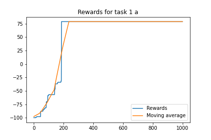
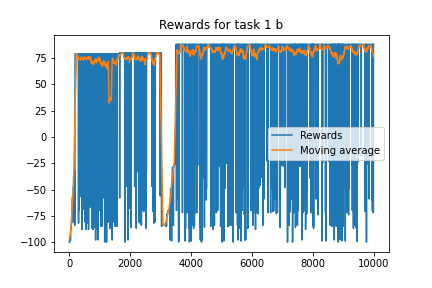
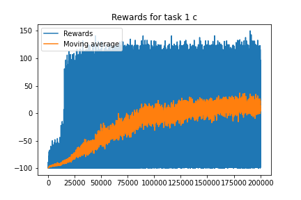
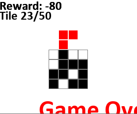
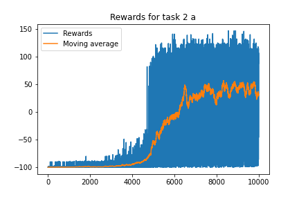

**1.a)**  

 
**1.b)**  
  Since we now have a epsilon > 0 we have exploration in comparison to A which doesn't. We can see that the moving average is around 75 which was what task 1 a converged to. But after a while the reward drops drastically due to exploration but then jumps up to a higher average reward of about 82. The rewards jumps way more in subtask b since on the exploration exploring worse action than the current best one.

 
**1.c)**  
The potential max would be 50/2*10^1 using a random sequence of tiles. So that it gets 150 does not mean that it is better than the strategy in b but this one is more general since of the random sequence of tiles. Therefore it takes longer for it to train since of the growth of possible states. As seen in the plot below the moving avrage is a lot lower and seem to start to converge at around 0. One would require to train the agent for a longer time to increase this.
 

 
When testing the strategy from C after training for 20k episodes on the deterministic tile sequence gives a -80 reward.
 

 
**1.d)**  
It is not possible to do since it would require in best case 2^19 bits of memory since the state space grows a lot and exploration of the state space would take a lot of time since of the sheer size of it. This is where a better approach would be a deep q-network.
 
**2.a)**  
Compared to the q learning in 1.c we can see that the moving average is much less noisy which indicates that even at a new state the network manage to aproximate the best action. With this approach after just training for 10k episodes the agent manage to average a score of around 45 on average. 
 

