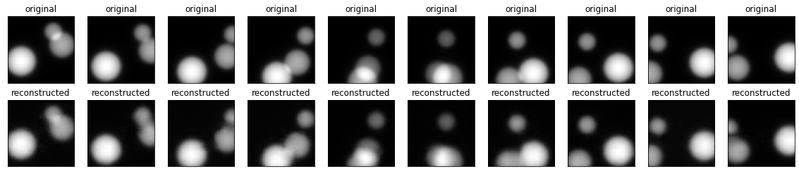
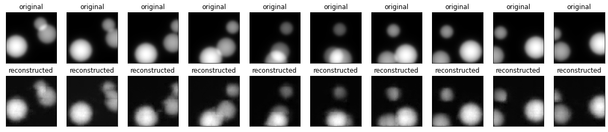
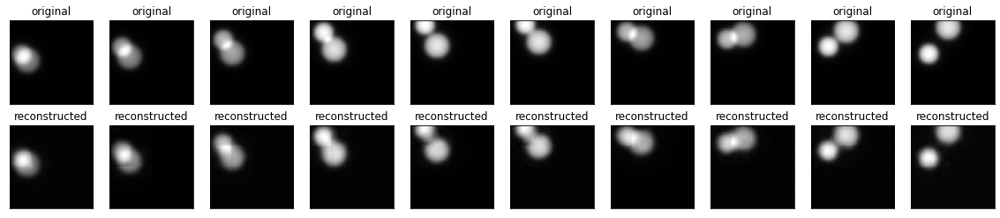
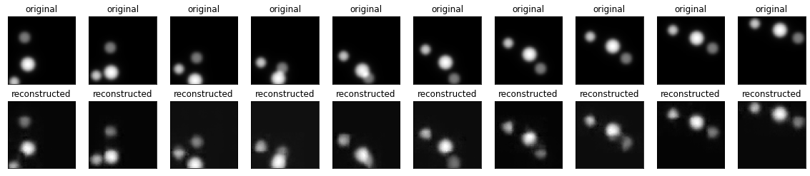
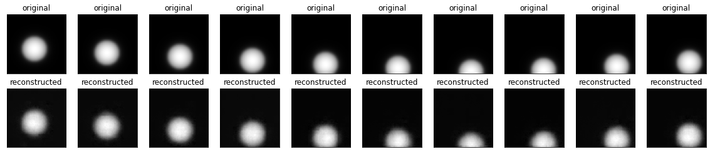

**1.)**  
Autoencoder comparison with different amount of nodes at bottle neck:  
256 
 
128 
 
64 
 
Different images:  
256 
 
128 
 
64 
 
**2.)**  
After some different testing these are the transformers that were the best. All training on 9 images in sequence and then trying to:  
Transformer encoder (64) using the 64 features bottle neck. 
On test data: 
 
On val data: 
 

Same as before but using the 256 neck encoder. 
On test data: 
 
On val data: 
 

Using 256 bottle neck but with a different network. 
On test data: 
 
On val data: 
 

**3.)**  
Using a LSTM and different latent features in the bottle neck layer.
64: 
 
256: 
 